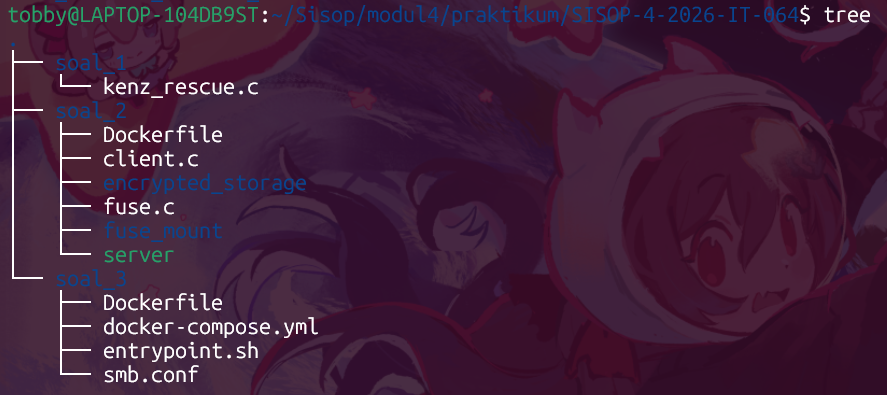
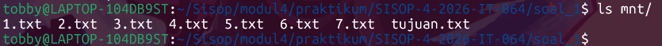
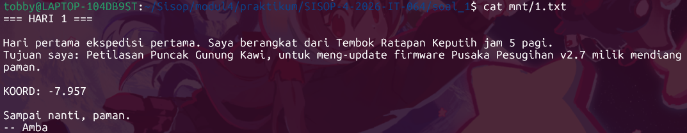
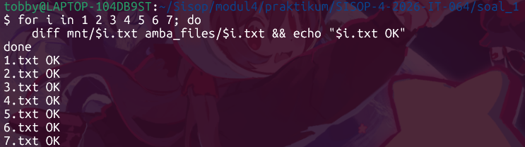
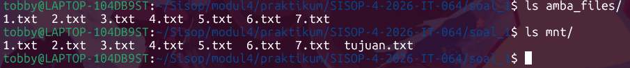
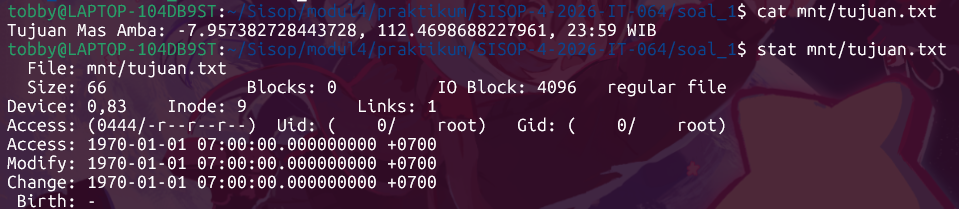
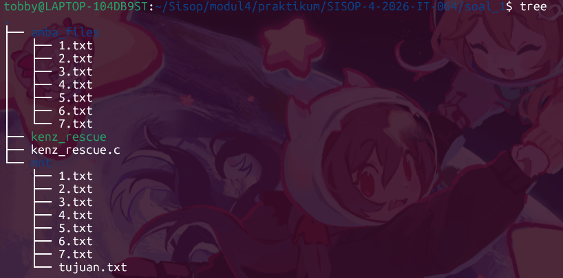

# SISOP-4-2026-IT-064

**Nama:** I Made Tobby Anantha Adiwijaya  
**Prodi:** Teknologi Informasi  
**NRP:** 5027251064  

## Table of Contents
- [Struktur Repository](#struktur-repository)  
- [Soal 1 - Save Asisten Kenz](#soal-1---save-asisten-kenz)  
    - [kenz_rescue.c](#kenz_rescuec)  
    - [Uji Coba](#uji-coba)  
- [Soal 2 - Poke MOO](#soal-2---poke-moo)  
    - [fuse.c](#fusec)  
    - [Dockerfile](#dockerfile)  
    - [client.c](#clientc)  
    - [Uji Coba](#uji-coba-1)  

## Struktur Repository
  

## Soal 1 - Save Asisten Kenz
Pada soal ini diminta untuk membantu menyelamatkan Asisten KENZ. Di mana diminta membuat sebuah filesystem berbasis FUSE (Filesystem in Userspace) dengan konsep passthrough filesystem. Filesystem ini membaca file asli dari direktori sumber (``amba_files``) lalu menampilkannya melalui mount directory. Selain melakukan passthrough file biasa, soal juga meminta pembuatan sebuah file virtual bernama ``tujuan.txt``. File virtual tersebut tidak benar-benar tersimpan di disk, tetapi dibuat secara dinamis saat dibaca.

Pertama, ambil arsip Amba Files dari *Flashdisk* dengan menggunakan:
```bash
wget -O amba_files.zip "https://drive.usercontent.google.com/u/0/uc?id=1nLXFhptDo2mnUlZsw8pTWyAVpV49W20U&export=download"
```

Setelah itu, unzip arsip menggunakan:
```bash
unzip amba_files.zip
```

Hasilnya akan berupa sebuah folder ``amba_files/`` dengan file 1.txt hingga 7.txt, masing-masing memuat bagian yang mengandung kata ``KOORD:``, yang di mana tugas kita yakni mengambil isi koordinat setelah kata tersebut dan menggabungkan seluruh potongan koordinat menjadi satu tujuan lengkap. Tidak lupa juga untuk menghapus file ``amba_files.zip`` sesuai arahan soal.

### kenz_rescue.c

#### Helper ``build_path()``
```c
void build_path(char fpath[1024], const char *path) {
    sprintf(fpath, "%s%s", source_dir, path);
}
```
Menggabungkan ``source_dir`` (direktori sumber yang diberikan saat mount) dengan ``path`` (jalur relatif di dalam FUSE). Hasil disimpan di ``fpath``. Digunakan untuk mendapatkan lokasi file fisik pada sistem asli.

#### xmp_getattr
```c
static int xmp_getattr(const char *path, struct stat *stbuf, struct fuse_file_info *fi) {
    (void) fi;

    int res;
    char fpath[1024];

    memset(stbuf, 0, sizeof(struct stat));

    // file virtual tujuan.txt
    if (strcmp(path, "/tujuan.txt") == 0) {
        stbuf->st_mode = S_IFREG | 0444;
        stbuf->st_nlink = 1;

        char content[10000] = "Tujuan Mas Amba: ";
        char temp[2048];

        for (int i = 1; i <= 7; i++) {
            sprintf(temp, "%s/%d.txt", source_dir, i);

            FILE *fp = fopen(temp, "r");
            if (fp) {
                char buffer[1024];

                while (fgets(buffer, sizeof(buffer), fp)) {

                    char *ptr = strstr(buffer, "KOORD:");

                    if (ptr != NULL) {
                        ptr += strlen("KOORD:");

                        while (*ptr == ' ')
                            ptr++;

                        strcat(content, ptr);

                        // hapus newline biar nyambung
                        content[strcspn(content, "\n")] = 0;
                    }
                }

                fclose(fp);
            }
        }
        strcat(content, "\n");

        stbuf->st_size = strlen(content);
        return 0;
    }

    build_path(fpath, path);

    res = lstat(fpath, stbuf);
    if (res == -1) {
        return -errno;
    }
    
    return 0;
}
```
Fungsi ``getattr()`` dipanggil ketika sistem operasi memerlukan atribut file. Awalnya struktur ``stat`` dibersihkan dengan ``memset(stbuf, 0, sizeof(struct stat));`` agar tidak ada data sisa di memori. Fungsi kemudian memeriksa apakah file yang diminta adalah ``/tujuan.txt``. Jika iya, maka file virtual dibuat di mana ``S_IFREG`` sebagai file biasa, ``0444`` sebagai read only, dan ``st_nlink=1`` untuk jumlah hardlink file.

Selanjutnya menghitung isi file virtual (dengan memanggil looping baca dari semua file 1.txt..7.txt untuk mencari KOORD:). Setiap file dibuka dengan menggunakan ``FILE *fp = fopen(temp, "r");``, kemudian digunakan ``char *ptr = strstr(buffer, "KOORD:");`` mencari kata ``KOORD:``. Jika ditemukan, pointer digeser melewati kata tersebut dengan ``ptr += strlen("KOORD:");``, spasi dihapus, dan koordinat kemudian digabung dengan ``strcat(content, ptr);``. Setelah seluruh file diproses, ``stbuf->st_size = strlen(content);`` digunakan agar kernel mengetahui ukuran file virtual.  

Jika bukan file virtual maka dijalankan ``lstat(fpath, stbuf)`` untuk mengambil atribut file asli.

#### xmp_readdir
```c
static int xmp_readdir(const char *path, void *buf,
                       fuse_fill_dir_t filler, off_t offset,
                       struct fuse_file_info *fi,
                       enum fuse_readdir_flags flags) {
    (void) offset;
    (void) fi;
    (void) flags;

    DIR *dp;
    struct dirent *de;

    char fpath[1024];
    build_path(fpath, path);

    dp = opendir(fpath);
    if (dp == NULL) {
        return -errno;
    }

    while ((de = readdir(dp)) != NULL) {
        struct stat st;

        memset(&st, 0, sizeof(st));
        st.st_ino = de->d_ino;
        st.st_mode = de->d_type << 12;

        if (filler(buf, de->d_name, &st, 0, 0)) {
            break;
        }
    }

    closedir(dp);

    if (strcmp(path, "/") == 0) {
        struct stat st;
        memset(&st, 0, sizeof(st));
        st.st_mode = S_IFREG | 0444;

        filler(buf, "tujuan.txt", &st, 0, 0);
    }

    return 0;
}
```
Fungsi ini dipanggil ketika pengguna membuka isi direktori. Contohnya saat ``ls mnt``. Awalnya path virtual diterjemahkan dengan ``build_path(fpath, path);``. Kemudian direktori dibuka dengan ``dp = opendir(fpath);``. Selanjutnya seluruh isi direktori dibaca dengan ``while ((de = readdir(dp)) != NULL)``. Setiap file kemudian akan dimasukkan ke buffer FUSE dengan ``(filler(buf, de->d_name, &st, 0, 0))``. Di sini, fungsi `filler()` bertugas mengirim nama file agar muncul saat pengguna menjalankan `ls`. Setelah semua file selesai dibaca, fungsi menambahkan file virtual dengan ``filler(buf, "tujuan.txt", &st, 0, 0);``. Sehingga, walaupun file tersebut tidak ada secara fisik di direktori asli, file tetap muncul di hasil mount.

#### xmp_open
```c
static int xmp_open(const char *path, struct fuse_file_info *fi) {
    // tujuan.txt virtual
    if (strcmp(path, "/tujuan.txt") == 0) {
        return 0;
    }

    int res;
    char fpath[1024];

    build_path(fpath, path);

    res = open(fpath, fi->flags);
    if (res == -1) {
        return -errno;
    }

    close(res);
    return 0;
}
```
Fungsi ini dipanggil ketika file dibuka. Contohnya saat ``cat mnt/1.txt`` atau ``nano file``. Jika path adalah ``/tujuan.txt``, langsung sukses (file virtual tidak perlu dibuka secara fisik).  

Untuk file virtual:
```c
if (strcmp(path, "/tujuan.txt") == 0) {
    return 0;
}
```

Untuk file biasa:
```c
res = open(fpath, fi->flags);
```

Jika gagal, maka akan ``return -errno;``. Jika berhasil, maka File descriptor ditutup kembali dengan ``close(res);``.

#### xmp_read
```c
static int xmp_read(const char *path, char *buf, size_t size,
                    off_t offset, struct fuse_file_info *fi) {
    (void) fi;

    // Virtual file tujuan.txt
    if (strcmp(path, "/tujuan.txt") == 0) {
        char content[10000] = "Tujuan Mas Amba: ";
        char temp[2048];

        for (int i = 1; i <= 7; i++) {
            sprintf(temp, "%s/%d.txt", source_dir, i);

            FILE *fp = fopen(temp, "r");
            if (fp) {
                char buffer[1024];

                while (fgets(buffer, sizeof(buffer), fp)) {

                    char *ptr = strstr(buffer, "KOORD:");

                    if (ptr != NULL) {
                        ptr += strlen("KOORD:");

                        while (*ptr == ' ')
                            ptr++;

                        strcat(content, ptr);

                        // hapus newline biar nyambung
                        content[strcspn(content, "\n")] = 0;
                    }
                }

                fclose(fp);
            }
        }
        strcat(content, "\n");

        size_t len = strlen(content);

        if (offset < len) {
            if (offset + size > len) {
                size = len - offset;
            }
            memcpy(buf, content + offset, size);
        }
        else {
            size = 0;
        }

        return size;
    }

    // Passthrough biasa
    int fd;
    int res;

    char fpath[1024];
    build_path(fpath, path);

    fd = open(fpath, O_RDONLY);
    if (fd == -1) {
        return -errno;
    }
    res = pread(fd, buf, size, offset);
    if (res == -1) {
        res = -errno;
    }
    close(fd);
    return res;
}
```
Fungsi ini dijalankan saat isi file dibaca. Contohnya saat ``cat mnt/tujuan.txt``.  

Apabila file yang diminta adalah `tujuan.txt`, program membuat isi file secara dinamis. Untuk mekanisme pembentukannya sendiri hampir sama dengan fungsi `getattr()` sebelumnya, yakni dengan membuka file 1–7, mencari KOORD, mengambil isi setelah KOORD, dan menggabungkan hasilnya. Program menggunakan ``strstr()`` untuk pencarian teks dan ``strcat()`` untuk penggabungan. Setelah isi file selesai, fungsi ``memcpy(buf, content + offset, size);`` akan mengirim hasil ke buffer FUSE.

Apabila file yang diminta adalah file biasa, maka fungsi ``pread(fd, buf, size, offset)`` akan membaca file asli tanpa perubahan sehingga filesystem bersifat passthrough.

#### Struktur Fuse
```c
static struct fuse_operations xmp_oper = {
    .getattr = xmp_getattr,
    .readdir = xmp_readdir,
    .open    = xmp_open,
    .read    = xmp_read,
};
```
Menghubungkan fungsi‑fungsi di atas ke pustaka FUSE.

#### Main Function
```c
int main(int argc, char *argv[]) {
    if (argc < 3) {
        fprintf(stderr, "Usage: %s <source_dir> <mount_dir>\n", argv[0]);
        return 1;
    }

    realpath(argv[1], source_dir);

    // hapus argv source agar fuse membaca mountpoint dengan benar
    for (int i = 1; i < argc - 1; i++) {
        argv[i] = argv[i + 1];
    }

    argc--;

    return fuse_main(argc, argv, &xmp_oper, NULL);
}
```
Fungsi ini merupakan fungsi utama program. Program menerima input ``./kenz_rescue amba_files mnt`` dengan parameternya `argv[1]` sebagai direktori sumber dan `argv[2]` sebagai mount directory. Direktori sumber diubah menjadi path absolut dengan ``realpath(argv[1], source_dir);``. Tujuannya agar filesystem tetap berjalan walaupun lokasi eksekusi berubah.

Selanjutnya,
```c
for (int i = 1; i < argc - 1; i++) {
    argv[i] = argv[i + 1];
}
```
Argumen digeser karena FUSE hanya memerlukan:

```bash
./program mountpoint
```

Setelah itu, ``fuse_main(argc, argv, &xmp_oper, NULL)`` akan memulai seluruh callback FUSE. Ketika filesystem aktif, kernel akan memanggil *getattr*, *readdir*, *open*, dan *read* secara otomatis sesuai aktivitas pengguna.

### Uji Coba
Buat folder mkdir terlebih dahulu dengan ``mkdir mnt``. Setelah itu, compile file ``kenz_rescue.c`` dengan menggunakan:
```bash
gcc kenz_rescue.c `pkg-config fuse3 --cflags --libs` -o kenz_rescue
```

Kemudian, mounting menggunakan:
```bash
./kenz_rescue amba_files mnt
```

Apabila sudah selesai, unmount dengan menggunakan:
```bash
fusermount3 -u mnt
```
Atau bisa juga dengan:
```bash
umount mnt
```

Coba ``ls mnt``  


Coba ``cat mnt/1.txt``  


Coba jalankan untuk testing passthrough:
```bash
for i in 1 2 3 4 5 6 7; do
    diff mnt/$i.txt amba_files/$i.txt && echo "$i.txt OK"
done
```


Perbedaan antara ``ls mnt`` dengan ``ls amba_files``  


Temukan koordinat ritual dengan ``cat mnt/tujuan.txt``  


Struktur akhir:



## Soal 2 - Poke MOO
Pada soal ini diminta untuk membuat sebuah arsitektur mini database service bernama "Project MOO" yang memanfaatkan struktur direktori sebagai database dan file CSV sebagai tabel. Program berjalan sebagai server TCP pada port 9000. Client yang terhubung dapat melakukan operasi sesuai perintah yang disediakan.

Beberapa hal yang perlu diperhatikan:

- FUSE (Keamanan & Translasi File): Mengimplementasikan file system kustom yang bertindak sebagai jembatan/translator. Semua file yang dibuat di mount point (`fuse_mount`) akan dienkripsi secara transparan menggunakan algoritma XOR (key `0x76`) dan ditambahkan ekstensi `.enc` untuk disimpan di direktori fisik (`encrypted_storage`). Sebaliknya, membaca data dari `fuse_mount` akan secara otomatis mendekripsi file tersebut.

- Service ini di-containerisasi menggunakan Docker dengan base image ubuntu:latest, working directory /app, expose port 9000, dan image diberi tag soal-2-modul-4-sisop. Container dijalankan dengan nama db_app dan bind mount direktori fuse_mount ke /app/db di dalam container. Containerization bertujuan membungkus binary server MOO ke dalam sebuah container Docker (berbasis Ubuntu) agar berjalan di lingkungan yang terisolasi.

- Program client.c untuk berinteraksi dengan server melalui TCP socket.

### fuse.c

#### Variabel Global & Konstanta
```c
static const char *dirpath = ".../encrypted_storage";
const char XOR_KEY = 0x76;
```
Di sini `dirpath` untuk jalur absolut ke direktori encrypted_storage (tempat file terenkripsi disimpan). Kemudian `XOR_KEY` sebagai kunci untuk enkripsi/dekripsi (0x76 atau 118 desimal).

#### get_full_path
```c
static void get_full_path(char *fpath, const char *path) {
    char temp_path[1024];
    sprintf(temp_path, "%s%s", dirpath, path);
    
    struct stat st;
    if (stat(temp_path, &st) == 0 && S_ISDIR(st.st_mode)) {
        strcpy(fpath, temp_path);       // Jika direktori, tidak pakai .enc
    } else {
        sprintf(fpath, "%s%s.enc", dirpath, path);      // Jika file, asumsikan pakai .enc
        if (access(fpath, F_OK) == -1) {
             strcpy(fpath, temp_path);      // Fallback jika .enc tidak ada
        }
    }
}
```
Fungsi untuk menentukan path fisik di `encrypted_storage` berdasarkan path virtual (dari FUSE). Fungsi ini mengecek apakah target berupa direktori (tanpa `.enc`) atau file (wajib ditambahkan ekstensi `.enc`).Cara kerjanya membuat sementara `temp_path = dirpath + path`. Apabila `temp_path` adalah direktori, maka langsung gunakan `temp_path` (folder tidak diberi ekstensi `.enc`). Apabila bukan direktori (biasanya file), coba gunakan `temp_path + ".enc"`. Jika file `.enc` tidak ada, fallback ke `temp_path` (untuk kompatibilitas).

#### xmp_getattr
```c
static int xmp_getattr(const char *path, struct stat *stbuf) {
    int res;
    char fpath[1024];
    get_full_path(fpath, path);
    res = lstat(fpath, stbuf);
    if (res == -1) return -errno;
    return 0;
}
```
Fungsi untuk mengambil atribut (metadata) dari sebuah file atau direktori dengan memanggil `lstat()` pada path fisik (hasil `get_full_path`).

#### xmp_readdir
```c
static int xmp_readdir(const char *path, void *buf, fuse_fill_dir_t filler, off_t offset, struct fuse_file_info *fi) {
    char fpath[1024];
    get_full_path(fpath, path);
    DIR *dp;
    struct dirent *de;

    (void) offset;
    (void) fi;

    dp = opendir(fpath);
    if (dp == NULL) return -errno;

    while ((de = readdir(dp)) != NULL) {
        struct stat st;
        memset(&st, 0, sizeof(st));
        st.st_ino = de->d_ino;
        st.st_mode = de->d_type << 12;
        
        char filename[1024];
        strcpy(filename, de->d_name);
        
        // Sembunyikan .enc saat dilihat di fuse_mount
        char *ext = strstr(filename, ".enc");
        if (ext != NULL && strlen(ext) == 4) {
            *ext = '\0';
        }

        if (filler(buf, filename, &st, 0)) break;
    }
    closedir(dp);
    return 0;
}
```
Fungsi untuk membaca isi sebuah direktori. Secara khusus, fungsi ini memotong string ekstensi `.enc` sehingga ketika user melakukan `ls` di `fuse_mount`, akhiran tersebut akan dihapus (`*ext = '\0'`), sehingga di `fuse_mount` file terlihat tanpa `.enc`.

#### xmp_read
```c
static int xmp_read(const char *path, char *buf, size_t size, off_t offset, struct fuse_file_info *fi) {
    char fpath[1024];
    get_full_path(fpath, path);
    int fd = open(fpath, O_RDONLY);
    if (fd == -1) return -errno;

    int res = pread(fd, buf, size, offset);
    if (res == -1) res = -errno;
    else {
        // Dekripsi dengan XOR
        for (int i = 0; i < res; i++) {
            buf[i] ^= XOR_KEY;
        }
    }
    close(fd);
    return res;
}
```
Fungsi untuk membaca file dari `encrypted_storage`. Pertama membuka file fisik (`get_full_path`, otomatis berkas `.enc` jika ada). Kemudian membaca sejumlah byte dengan `pread()`. Setelah data dibaca ke buffer, fungsi ini melakukan perulangan `for` untuk mendekripsi setiap byte data menggunakan operasi XOR (`buf[i] ^= XOR_KEY`).

#### xmp_write
```c
static int xmp_write(const char *path, const char *buf, size_t size, off_t offset, struct fuse_file_info *fi) {
    char fpath[1024];
    sprintf(fpath, "%s%s.enc", dirpath, path); // Selalu simpan dengan .enc untuk file
    int fd = open(fpath, O_WRONLY);
    if (fd == -1) return -errno;

    char *enc_buf = malloc(size);
    // Enkripsi dengan XOR
    for (int i = 0; i < size; i++) {
        enc_buf[i] = buf[i] ^ XOR_KEY;
    }

    int res = pwrite(fd, enc_buf, size, offset);
    if (res == -1) res = -errno;
    
    free(enc_buf);
    close(fd);
    return res;
}
```
Fungsi untuk menerima buffer masukan. Pertama dialokasikan buffer baru, lalu mengenkripsi data menggunakan operasi XOR (`enc_buf[i] = buf[i] ^ XOR_KEY`). Menulis ke file dengan `pwrite()`. Data yang sudah terenkripsi kemudian ditulis ke dalam file berakhiran `.enc` di `encrypted_storage`.

#### xmp_create
```c
static int xmp_create(const char *path, mode_t mode, struct fuse_file_info *fi) {
    char fpath[1024];
    sprintf(fpath, "%s%s.enc", dirpath, path);
    int res = creat(fpath, mode);
    if (res == -1) return -errno;
    close(res);
    return 0;
}
```
Fungsi untuk membuat file baru di `encrypted_storage` dengan nama `path + ".enc"` (menggunakan `creat()`). File kosong yang sudah terenkripsi (isi 0 byte) akan siap ditulisi selanjutnya.

#### xmp_mkdir
```c
static int xmp_mkdir(const char *path, mode_t mode) {
    char fpath[1024];
    sprintf(fpath, "%s%s", dirpath, path);
    int res = mkdir(fpath, mode);
    if (res == -1) return -errno;
    return 0;
}
```
Fungsi untuk membuat baru direktori biasa (tanpa `.enc`) di `encrypted_storage`.

#### xmp_rmdir
```c
static int xmp_rmdir(const char *path) {
    char fpath[1024];
    sprintf(fpath, "%s%s", dirpath, path);
    int res = rmdir(fpath);
    if (res == -1) return -errno;
    return 0;
}
```
Fungsi untuk menghapus direktori kosong.

#### xmp_unlink
```c
static int xmp_unlink(const char *path) {
    char fpath[1024];
    sprintf(fpath, "%s%s.enc", dirpath, path);
    int res = unlink(fpath);
    if (res == -1) return -errno;
    return 0;
}
```
Fungsi untuk menghapus file `.enc`.

#### xmp_truncate
```c
static int xmp_truncate(const char *path, off_t size) {
    char fpath[1024];
    get_full_path(fpath, path);
    int res = truncate(fpath, size);
    if (res == -1) return -errno;
    return 0;
}
```
Fungsi untuk memotong ukuran file. Menggunakan `truncate()` pada path fisik (hasil `get_full_path`).

#### xmp_access
```c
static int xmp_access(const char *path, int mask) {
    char fpath[1024];
    get_full_path(fpath, path);
    int res = access(fpath, mask);
    if (res == -1) return -errno;
    return 0;
}
```
Fungsi untuk mengecek hak akses file (misal `access(fpath, mask)`).

#### xmp_ultimens
```c
static int xmp_utimens(const char *path, const struct timespec ts[2]) {
    char fpath[1024];
    get_full_path(fpath, path);
    int res = utimensat(0, fpath, ts, AT_SYMLINK_NOFOLLOW);
    if (res == -1) return -errno;
    return 0;
}
```
Fungsi untuk mengubah timestamp file (atime, mtime) menggunakan `utimensat()`.

#### xmp_open
```c
static int xmp_open(const char *path, struct fuse_file_info *fi) {
    char fpath[1024];
    get_full_path(fpath, path);
    int res = open(fpath, fi->flags);
    if (res == -1) return -errno;
    close(res);
    return 0;
}
```
Fungsi untuk membuka file *descriptor*.

#### Struktur Fuse
```c
static struct fuse_operations xmp_oper = {
    .getattr    = xmp_getattr,
    .readdir    = xmp_readdir,
    .read       = xmp_read,
    .write      = xmp_write,
    .mkdir      = xmp_mkdir,
    .rmdir      = xmp_rmdir,
    .create     = xmp_create,
    .unlink     = xmp_unlink,
    .truncate   = xmp_truncate,
    .access     = xmp_access,
    .utimens    = xmp_utimens,
    .open       = xmp_open,
};
```
Menghubungkan fungsi‑fungsi di atas ke pustaka FUSE.

#### Main Function
```c
int main(int argc, char *argv[]) {
    umask(0);
    return fuse_main(argc, argv, &xmp_oper, NULL);
}
```
Berfungsi sebagai *Entry point* yang mengatur mask direktori (`umask(0)`) dan mendaftarkan struktur `xmp_oper` ke daemon FUSE.

### Dockerfile
```dockerfile
FROM ubuntu:latest

# Set working directory
WORKDIR /app

# Copy server binary ke dalam container
COPY server /app/server

# Pastikan file server dapat dieksekusi
RUN chmod +x /app/server

# Buat folder db yang akan di-bind dengan fuse_mount
RUN mkdir -p /app/db

# Expose port TCP yang digunakan oleh MOO Database
EXPOSE 9000

# Jalankan server MOO
CMD ["./server"]
```
- Base image Ubuntu terbaru.
- Menyalin binary file `server` (program MOO database) ke `/app/server`.
- Memberi izin eksekusi.
- Membuat folder `/app/db` yang nantinya akan di-bind dengan `fuse_mount` dari host.
- Expose port 9000 untuk komunikasi TCP.
- Perintah default saat container dijalankan: `./server`.

### client.c

#### Deklarasi Variabel
```c
int sock = 0;
struct sockaddr_in serv_addr;
char buffer[BUFFER_SIZE] = {0};
char input[BUFFER_SIZE] = {0};
```
Di sini, integer `sock` adalah file descriptor socket. kemudian `serv_addr` adalah struktur alamat server (family, port, IP). Lalu, `buffer` untuk menyimpan data yang diterima dari server. Dan `input` untuk menyimpan baris perintah dari pengguna.

#### Pembuatan Socket
```c
if ((sock = socket(AF_INET, SOCK_STREAM, 0)) < 0) {
    printf("\n Error: Socket creation error \n");
    return -1;
}
```
Di sini, `AF_INET` yakni IPv4. `SOCK_STREAM` yakni TCP (connection-oriented). Kemudian `0` adalah protokol default (TCP). Jika gagal (`< 0`), tampilkan error dan keluar.

#### Mengisi Struktur Alamat Server
```c
serv_addr.sin_family = AF_INET;
serv_addr.sin_port = htons(PORT);

if (inet_pton(AF_INET, "127.0.0.1", &serv_addr.sin_addr) <= 0) {
    printf("\n Error: Invalid address/ Address not supported \n");
    return -1;
}
```
Di sini `sin_port` harus dalam network byte order (big-endian). `htons()` mengubah dari host ke network. Kemudian `inet_pton()` disini mengubah string IP `"127.0.0.1"` menjadi biner menggunakan `struct in_addr`. Nilai `<= 0` menandakan error (0 = tidak valid, -1 = format salah).

#### Menghubungkan ke Server
```c
if (connect(sock, (struct sockaddr *)&serv_addr, sizeof(serv_addr)) < 0) {
    printf("\n Error: Connection Failed \n");
    return -1;
}
```
Melakukan tiga‑way handshake TCP ke server. Jika gagal (misal server tidak berjalan), tampilkan error dan keluar.

#### Loop Utama
```c
while (1) {
    printf("db > ");
    memset(input, 0, BUFFER_SIZE);
    
    // Membaca input dengan fgets (otomatis simpan \n di akhir string)
    if (fgets(input, BUFFER_SIZE, stdin) != NULL) {
        
        // Cek perintah EXIT
        if (strncmp(input, "EXIT", 4) == 0) {
            break;
        }

        // Kirim input utuh beserta \n ke server
        send(sock, input, strlen(input), 0);
        
        // Tunggu dan baca balasan dari server
        memset(buffer, 0, BUFFER_SIZE);
        int bytes_read = read(sock, buffer, BUFFER_SIZE);
        if (bytes_read > 0) {
            printf("\n%s\n", buffer);
        }
    }
}
```
Di awali dengan `printf("db > ");` untuk tampilan prompt sederhana. Kemudian `memset(input, 0, BUFFER_SIZE);` untuk membersihkan buffer input dari iterasi sebelumnya.

Selanjutnya, `fgets(input, BUFFER_SIZE, stdin)` di sini akan:
- Membaca satu baris (termasuk newline `\n`).
- Berhenti jika mencapai `BUFFER_SIZE-1` karakter atau menemukan newline.
- Mengembalikan `NULL` hanya jika terjadi error atau EOF (Ctrl+D). Dalam program ini, EOF tidak ditangani secara khusus sehingga loop akan berhenti jika `fgets` gagal.

Kemudian, untuk pengecekan EXIT:
- `strncmp(input, "EXIT", 4)` di sini membandingkan 4 karakter pertama (EXIT). Jika sama, break keluar loop.

Lalu, untuk mengirim perintah:
- `send(sock, input, strlen(input), 0);`, di mana `strlen(input)` untuk mengirim seluruh baris termasuk newline. Dan server diharapkan memproses perintah yang diakhiri oleh sebuah newline.

Selanjutnya, untuk membaca balasan:
- Membaca dari socket dengan menggunakan `read(sock, buffer, BUFFER_SIZE);`
    - Di mana fungsi `read` bersifat *blocking*, yang artinya ia akan menunggu sampai ada data atau koneksi tertutup.
    - Jika server mengirim lebih dari `BUFFER_SIZE` byte, data akan terpotong.
- `bytes_read > 0` di mana jika ada data, cetak dengan newline ekstra (`printf("\n%s\n", buffer);`).
- Jika `bytes_read == 0`, berarti server menutup koneksi.

#### Penutupan Socket
```c
close(sock);
return 0;
```
Menutup socket dan keluar, membebaskan resource socket.

### Uji Coba
